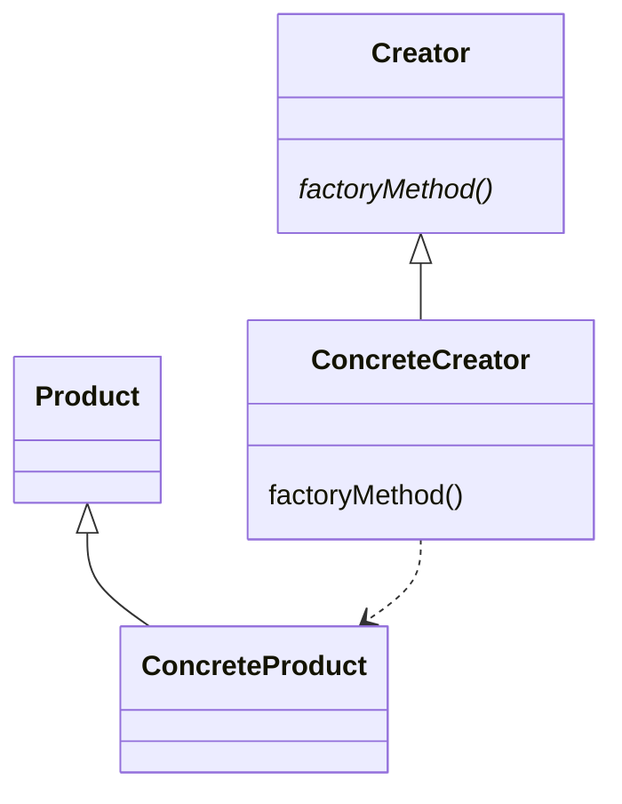
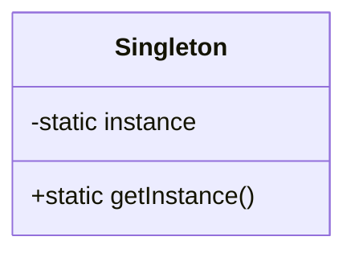
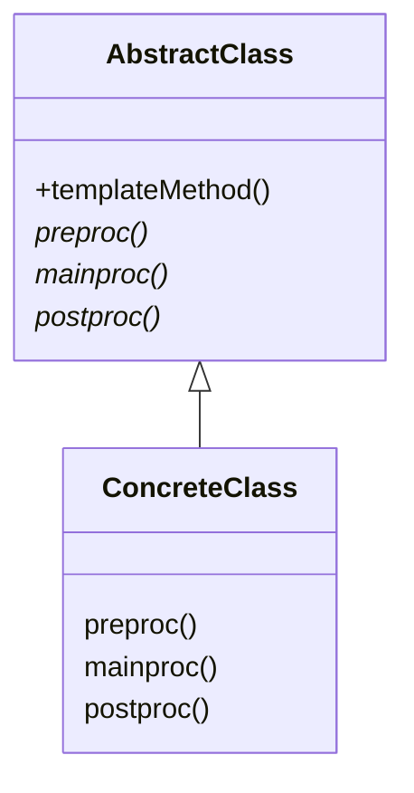
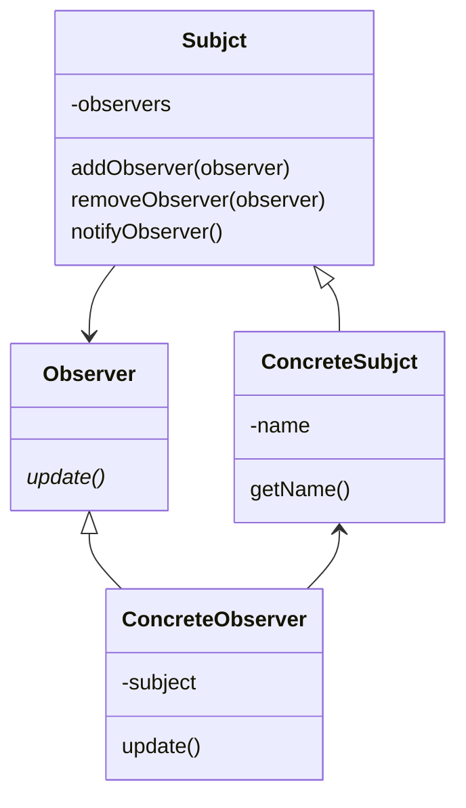

# Principal

- 流動的要素をカプセル化する
- クラス継承よりもオブジェクト集約を多用する

# Diagram

## Factory Method Pattern

```mermaid
classDiagram

class Creator {
  factoryMethod()*
}

class ConcreteCreator {
  factoryMethod()
}

Creator <|-- ConcreteCreator
Product <|-- ConcreteProduct
ConcreteCreator ..> ConcreteProduct
```

## Singleton Pattern

```mermaid
classDiagram

class Singleton
Singleton : -static instance
Singleton : +static getInstance()
```

## Template Method Pattern

```mermaid
classDiagram

class AbstractClass
AbstractClass : +templateMethod()
AbstractClass : preproc()*
AbstractClass : mainproc()*
AbstractClass : postproc()*

class ConcreteClass
ConcreteClass : preproc()
ConcreteClass : mainproc()
ConcreteClass : postproc()

AbstractClass <|-- ConcreteClass
```

## Observer Pattern

```mermaid
classDiagram

class Subjct
Subjct : -observers
Subjct : addObserver(observer)
Subjct : removeObserver(observer)
Subjct : notifyObserver()

class ConcreteSubjct
ConcreteSubjct : -name
ConcreteSubjct : getName()

class Observer
Observer : update()*

class ConcreteObserver
ConcreteObserver : -subject
ConcreteObserver : update()

Subjct <|-- ConcreteSubjct
Observer <|-- ConcreteObserver
Subjct --> Observer
ConcreteSubjct <-- ConcreteObserver
```
