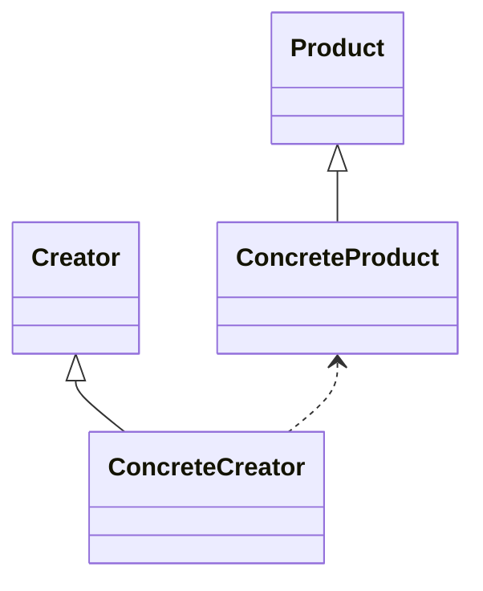

# Principal

- 流動的要素をカプセル化する
- クラス継承よりもオブジェクト集約を多用する

# Diagram

## Factory Method Pattern

```mermaid
classDiagram
     Creator <|-- ConcreteCreator
     Product <|-- ConcreteProduct
     ConcreteProduct <.. ConcreteCreator
```
